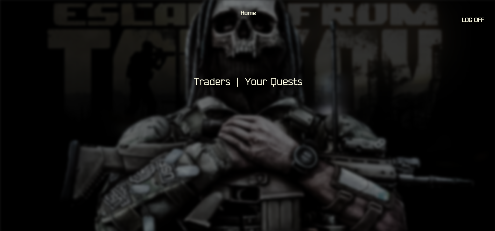

# Tarkov Companion

Tarkov companion is an app that helps you track your quests in one place.

## Technologies Used

- HTML
- CSS
- JavaScript
- MongoDB and Atlas
- Mongoose
- Express JS
- GitHub
- Google Passport
- Vercel
- Node JS

## Getting Started

Link to the website - [Tarkov Companion](https://tarkov-companion.vercel.app/)

## Next Steps:

- More quests added.
- More information about each quest such as rewards.
- Add an interactable map with clickable pins of your selected quests selected, which show information on how to complete the quest.
- Boss section.